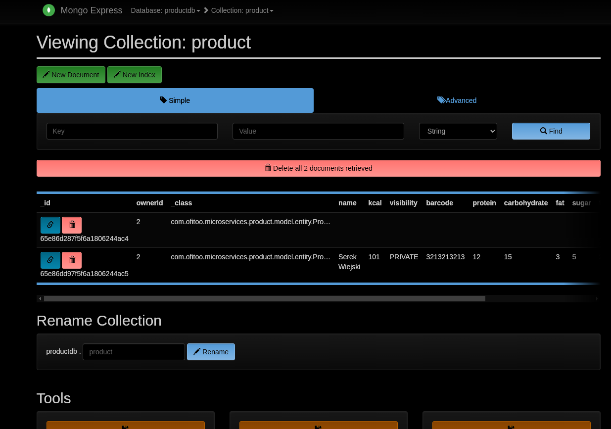
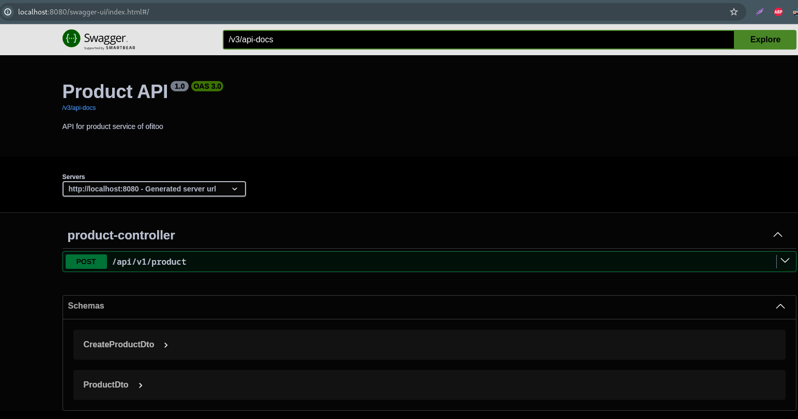

# Ofitoo Api
oFitoo is an innovative mobile application designed to help you take care of your health , monitor your nutrition   
and achieve goals related to diet and physical activity.   
The application combines the best features of popular solutions such as MyFitnessPal and Fitatu, while offering   
simplicity and the ability to disconnect modules that are unnecessary for us.  


### The main features of oFitoo are:  

**Calorie Intake Tracker:** Monitor your daily calorie, macronutrient and micronutrient intake to stay on top of your diet.  
**Meal Planning:** Create personalized eating plans tailored to your goals and preferences.  
**Barcode Scanning:** Add foods to your food diary quickly and easily by scanning their barcodes.  
**Statistics and Charts:** Receive charts and statistics to help you monitor your progress and achieve your goals.  
**Social and Motivation:** Allow your partner to edit your meals, making it easier to track your meals and track your performance.  


## Directory Structure
The directory structure of the project is as follows including important files:

```yaml
├── microservices
│     ├── calorie-tracker
│     ├── habit-tracker 
│     ├── notification
│     ├── product
│     ├── user
│
│
├── .github
│     ├── workflows # Git Actions CI/CD files
│     ├── ISSUE_TEMPLATE # Git Actions issue form templates
│
│
├── scripts
      ├── product-db.yml
```

## Prerequisites
- java 21 (graalvm-ce-21)
- maven
- docker

## Clone the Repository
```shell
git clone https://github.com/Progress-House/ofitoo-api
```

## Building and Launching single Microservice
The example shown on "product" service, analogously every else service.

### Run docker-compose in order to set up a database
It is very important to do this before building the project, spring data JPA (hibernate) maps entities to the database. 
If the database does not exist, it will throw an error.

if you are a windows user you need to run docker desktop


We launch the database for the service we want to launch, in this case for "product" service.
```shell
cd ofitoo-api/scripts
docker-compose -f product-db.yml up -d
# or analogously every else database
```

### build and run
```shell
cd ofitoo-api/microservice
cd product 
# or analogously other service
mvn clean package
mvn spring-boot:run 
# or use run/debug configuration from intelij idea
```

### Compass-UI
if we run docker-compose for any mongoDB, we can view the database in compass UI.  
For example:  
http://localhost:8081/db/productdb/product  
Credentials: admin / pass  


### Swagger UI
if we run for example product service, we can view auto documentation in swagger ui  
and test endpoints without using Postman  


http://localhost:8080/swagger-ui/index.html  